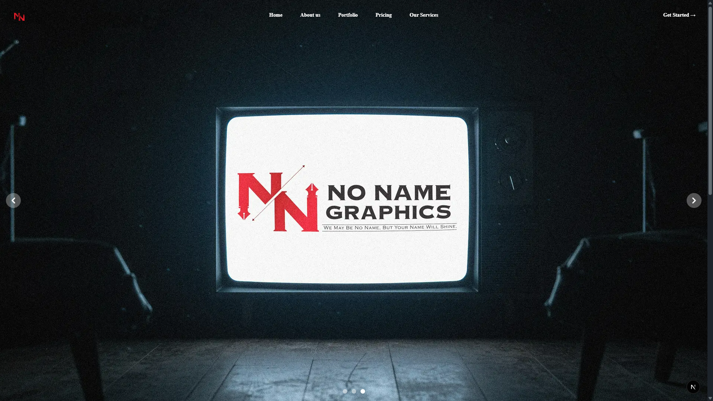

# No Name Graphics

Welcome to the official repository for the No Name Graphics agency website.

---

---

## About No Name Graphics

**No Name Graphics** is a creative agency based in New Delhi, India, specializing in branding, design, motion graphics, printables, video editing, and web solutions.  
We help brands stand out with bold ideas, functional design, and a collaborative approach.

- **Website:** [nonamegraphics.com](https://nonamegraphic.com)
- **Contact:** [info@nonamegraphics.com](mailto:info@nonamegraphics.com)

---

## About This Repository

This codebase powers the official No Name Graphics landing page and portfolio.  
It is provided for transparency and inspiration only.

**Please do not clone, redistribute, or deploy this project as your own.**

---

## Technologies Used

- [Next.js](https://nextjs.org/) (App Router)
- [Tailwind CSS](https://tailwindcss.com/)
- [TypeScript](https://www.typescriptlang.org/)
- [Framer Motion](https://www.framer.com/motion/)
- [Keen Slider](https://keen-slider.io/)
- [Google Fonts](https://fonts.google.com/)

---

## License & Usage

This repository is **not** open source and is intended for reference only.  
All content, images, and code are the property of No Name Graphics and may not be reused or deployed elsewhere.

If you are interested in working with us or want to learn more, please [contact us](mailto:info@nonamegraphics.com).

---

**© No Name Graphics. All rights reserved.**
